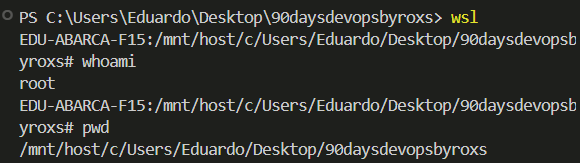
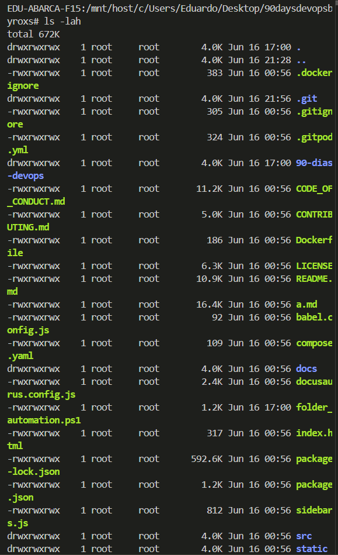
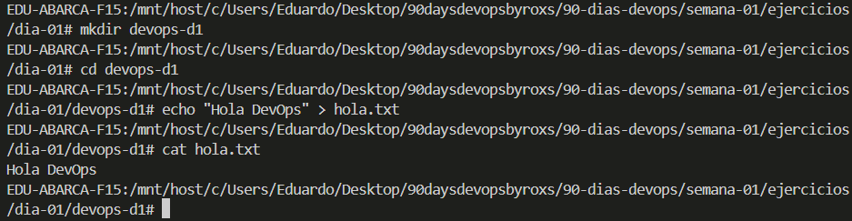
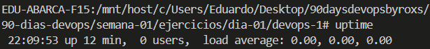
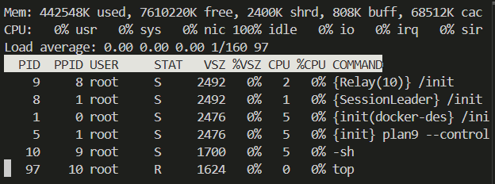
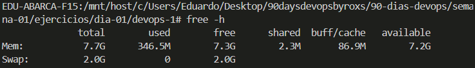
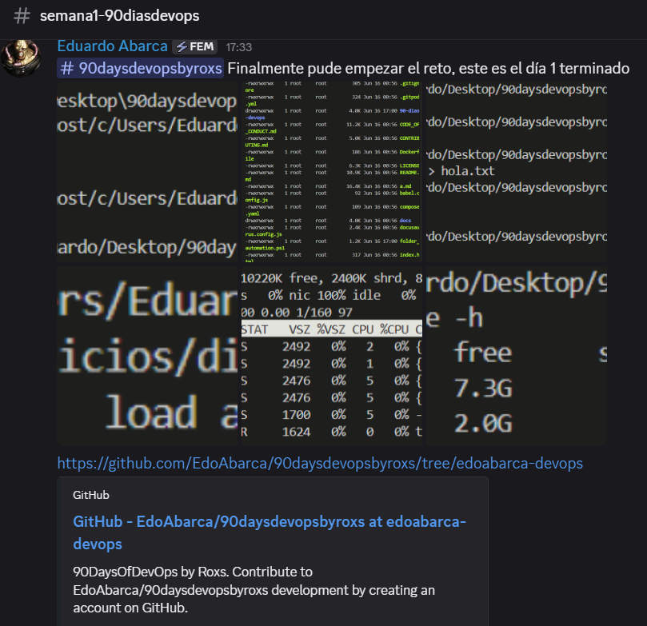

# 📚 Tarea Opcional del Día 1

> 💬 *“La mejor forma de aprender DevOps… es haciéndolo.”*

Te propongo algunos ejercicios prácticos para que pongas en acción lo aprendido hoy:

## 1. 🧠 Reflexión Personal

* Escribí en un archivo `.md`:
  👉 ¿Qué significa DevOps para vos después de esta lección?
  **Respuesta:**
  DevOps es una filosofía del mundo IT que consiste en forjar un cambio cultural de desarrollo de software, gestando el trabajo colaborativo entre los equipos de Desarrollo y Operaciones para automatizar la integración y despliegue de productos de software en entornos de producción.

  👉 ¿Qué herramientas ya conocías y cuáles son nuevas?
	**Respuesta:** Gracias a mi experiencia como desarrollador de software, conozco todas las herramientas mencionadas en el enunciado, al menos hasta un nivel teórico. Sin embargo, hay herramientas que no he usado (Ansible, Terraform y Kubernetes), principalmente por preferir plataformas *PaaS* para efectos de despliegue.

## 2. 🖥️ Primeros Pasos en Linux

* Si estás en Windows, instalá [WSL2 (Windows Subsystem for Linux)](https://learn.microsoft.com/es-es/windows/wsl/install).
* Si estás en Mac, abrí la terminal y ejecutá:

  ```bash
  uname -a
  ```
> Hasta el día de hoy trabajo en Windows con Docker Desktop, por lo que WSL2 está instalado, y se usará para todo lo que tenga que ver con Linux, terminal, bash scripting, Docker y otras herramientas que estén involucradas.

* Probá estos comandos básicos:

  ```bash
  whoami
  pwd
  ls -lah
  mkdir devops-d1
  cd devops-d1
  echo "Hola DevOps" > hola.txt
  cat hola.txt
  ```
* Tambien puedes probar las opciones de terminal online en DevOps-Tools

**Respuesta:** A continuación se pueden ver los pantallazos con los resultados:



- *wsl* inicializa el subsistema Linux
- *whoami* muestra el usuario que está a cargo del subsistema
- *pwd* muestra la ruta absoluta del dirctorio actual



- *ls -lah* muestra todos los archivos y subdirectorios del directorio actual, con el usuario que los maneja y los permisos correspondientes



- *mkdir* permite crear un nuevo directorio
- *cd* permite cambiar de directorio
- *echo* permite escribir contenido por consola, el cuál, mediante '*>*', permite guardar en disco el contenido escrito
- *cat* permite mostrar el contenido guardado en un archivo

## 3. 🎯 Desafío: ¡Linux Detectives!

Usando solo comandos en la terminal, respondé estas preguntas:

* ¿Cuánto tiempo lleva encendido tu sistema?

  ```bash
  uptime
  ```



* ¿Qué procesos están consumiendo más recursos?

  ```bash
  top
  ```

* ¿Cuánta memoria disponible tenés?

  ```bash
  free -h
  ```



## 4. 📺 Recurso recomendado

* Mirá este video explicativo de DevOps (elige uno corto y dinámico):
  👉 [¿Qué es DevOps?](https://www.youtube.com/watch?v=_I94-tJlovg)

**Interpretación:** Este video muestra un caso típico a evaluar en el mundo del desarrollo de software, en el que postulan a 2 personas que representan los equipos de desarrollo (Devs) y operaciones (IT):
 - Dave (Dev): Se encarga de la creación y mantención del software de la empresa, gestando despliegues aislados y manuales, retardando la puesta en producción del software y quedando atrás frente a competidores. Además, él trabaja principalmente en un entorno de desarrollo, lo que genera conflictos con el entorno de producción
 - Anna (IT): Se encarga de la administración de los sistemas. Constantemente se enfrenta a que la empresa lanza nuevos productos, por lo que el pelotón de servidores crece, y las herramientas que ella tiene a mano no son lo suficientemente efectivas en este nuevo contexto. Cada vez que código se despliega a producción, es su deber monitorear y diagnosticar cualquier problema o error generado por los cambios.
 - Devs y Ops (IT) trabajan por separado

>¿Qué se puede hacer para que Dave y Anna trabajen mejor?

- Fomentar la colaboración entre Dev y Ops.
- Compartir responsabilidades y objetivos comunes.
- Romper los silos organizacionales.
- Adoptar una mentalidad y filosofía unificadas.
- Automatizar los procesos de integración, despliegue y monitoreo.
- *Cambio de filosofía de desarrollo*

El objetivo de integrar DevOps es automatizar todo el proceso de entrega de software, desde su integración hasta su despliegue y posterior monitoreo.

Los beneficios que busca traer son:
 - Entrega de software constante y en menos tiempo
 - Mayor foco en la mejora del negocio
 - Desarrolladores y clientes con mayor índice de satisfacción :)

## 5. 💬 Compartí tus avances

* Subí una captura de tu terminal al canal de la comunidad o en redes usando el hashtag:
  **#DevOpsConRoxs**
  *(¡siempre se aprende más compartiendo!)*


